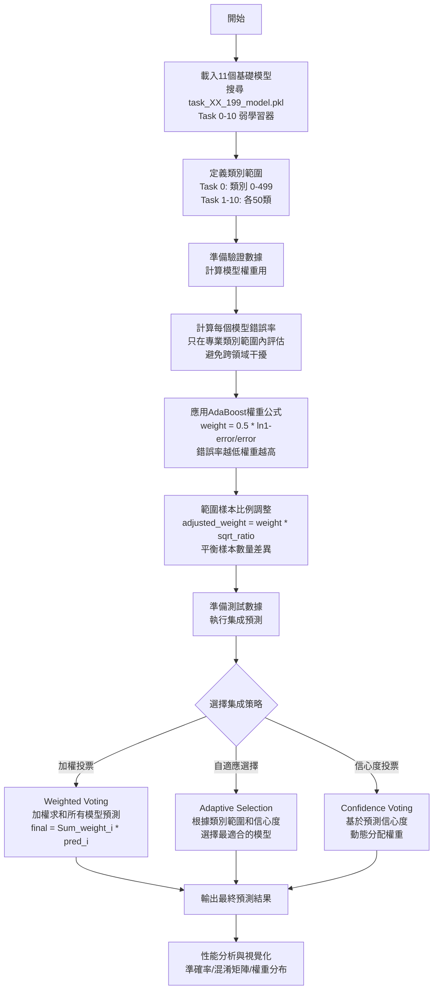
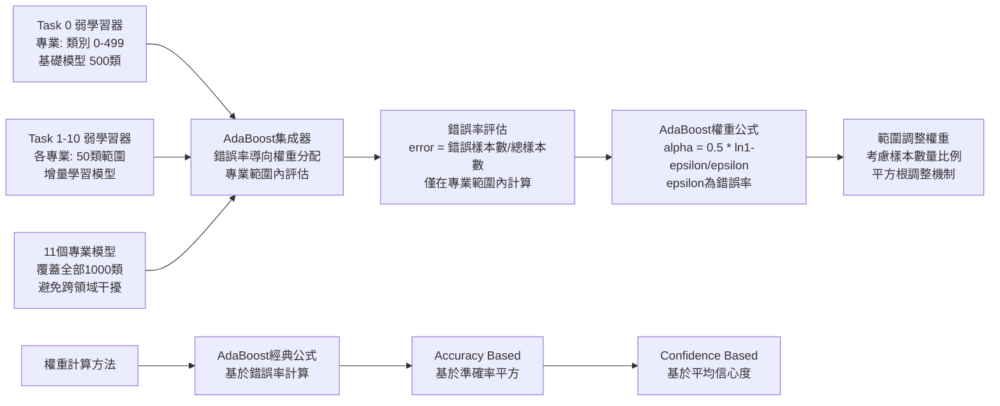
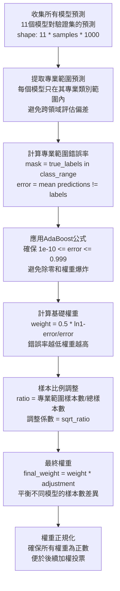
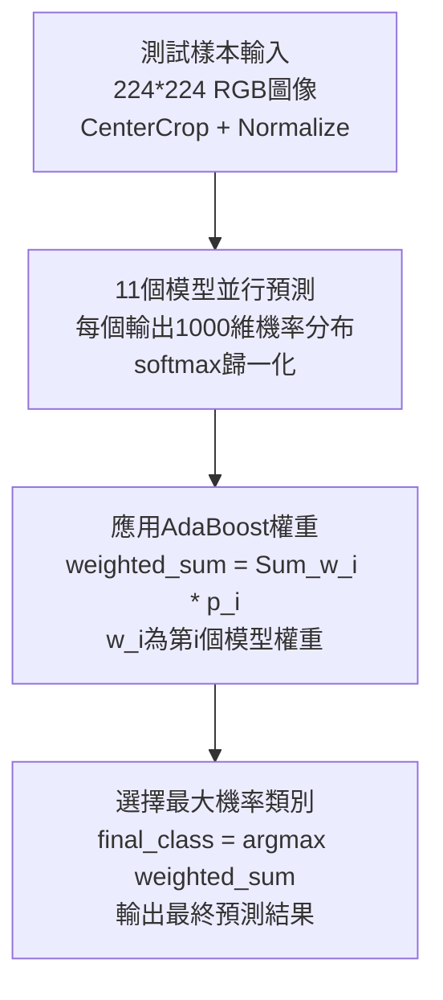
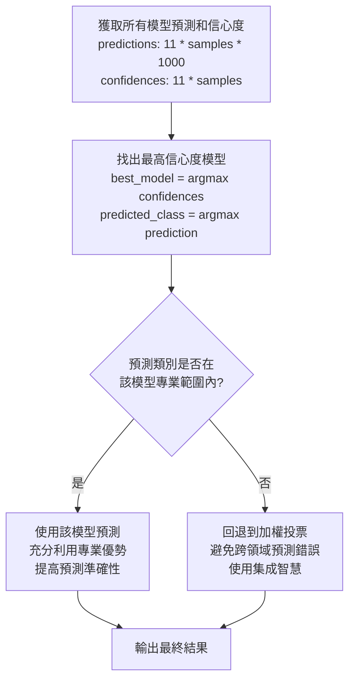
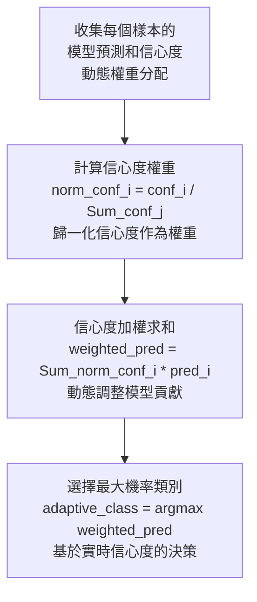

# AdaBoost Ensemble 集成學習流程圖

## 核心AdaBoost方法流程



## AdaBoost核心概念



## 權重計算過程



## 集成預測策略

### 1. 加權投票策略



### 2. 自適應選擇策略



### 3. 信心度投票策略



## 方法特點與技術優勢

**專業範圍評估**:
- 每個模型只在其專業類別範圍內評估
- Task 0: 500個基礎類別 (0-499)
- Task 1-10: 各50個增量類別
- 避免跨領域評估造成的偏差

**錯誤率導向權重分配**:
- AdaBoost經典公式: α = 0.5 × ln((1-ε)/ε)
- 錯誤率範圍限制: [1e-10, 0.999]
- 樣本比例平方根調整機制
- 動態權重正規化

**多策略集成**:
- 加權投票: 穩定的基礎策略
- 自適應選擇: 專業範圍內優先策略
- 信心度投票: 動態調整權重策略
- 支援運行時策略切換

**記憶體優化**:
- 批次大小: 128 (可調整)
- CPU預測收集節省GPU記憶體
- 並行模型推理提升效率
- 分批處理大型數據集

## 性能分析與評估指標

**整體性能比較**:
- 集成準確率 vs 最佳個別模型
- 11個模型的個別準確率分析
- 權重分布視覺化
- 改善幅度量化 (集成-最佳個別)

**類別級別分析**:
- 前500類 vs 後500類性能對比
- 每個類別的詳細準確率
- 專業範圍內的模型表現
- 跨領域預測失誤分析

**模型權重分析**:
- AdaBoost權重分布圖
- 權重與錯誤率的關係
- 專業範圍樣本數影響
- 權重調整效果驗證

**混淆矩陣分析**:
- 前100類的詳細混淆矩陣
- 類別間的預測混淆模式
- 專業模型的預測偏好
- 集成效果的視覺化驗證

## 核心參數配置總結

| 參數項目 | 數值/設定 | 說明 |
|---------|-----------|------|
| 弱學習器數量 | 11個 | Task 0-10 專業模型 |
| 總類別數 | 1000 | 完整醫學影像分類 |
| Task 0 類別 | 500 (0-499) | 基礎類別範圍 |
| 增量Task類別 | 50/每個 | Task 1-10 各負責50類 |
| 權重計算方法 | adaboost | 經典AdaBoost公式 |
| 錯誤率下限 | 1e-10 | 避免除零錯誤 |
| 錯誤率上限 | 0.999 | 防止權重爆炸 |
| 樣本調整係數 | sqrt(ratio) | 平方根調整機制 |
| 批次大小 | 128 | 記憶體優化 |
| 集成策略 | weighted_voting | 預設加權投票 |
| 圖像尺寸 | 224×224 | 標準輸入格式 |
| 正規化參數 | ImageNet標準 | mean=[0.485,0.456,0.406] |

## 輸出文件結構

```
AdaBoost_Results/
├── AdaBoost_adaboost_weighted_voting/
│   └── run_YYYYMMDD_HHMMSS/
│       ├── performance_report.json      # 詳細性能數據
│       ├── performance_summary.txt      # 文字摘要報告
│       ├── overall_performance.png      # 整體性能比較圖
│       ├── class_wise_performance.png   # 類別級別分析圖
│       ├── model_weights.png           # 模型權重分布圖
│       └── confusion_matrix.png        # 混淆矩陣熱力圖
```

## AdaBoost vs Stacking 比較

| 特徵比較 | AdaBoost | Stacking |
|---------|----------|----------|
| 核心理念 | 錯誤率導向權重分配 | 元模型學習最佳組合 |
| 權重計算 | 基於專業範圍錯誤率 | 可訓練權重矩陣 |
| 複雜度 | 相對簡單，公式明確 | 較複雜，需要額外訓練 |
| 適應性 | 固定權重，運行時高效 | 動態學習，更靈活 |
| 專業性 | 強調專業範圍評估 | 全局最佳化組合 |
| 計算開銷 | 低，僅權重計算 | 中等，需元模型訓練 |
``` 