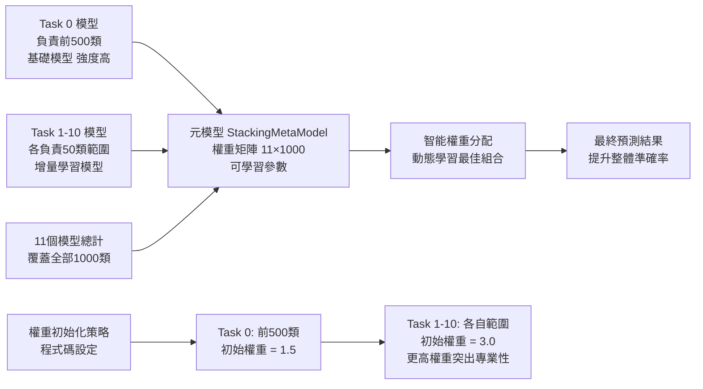
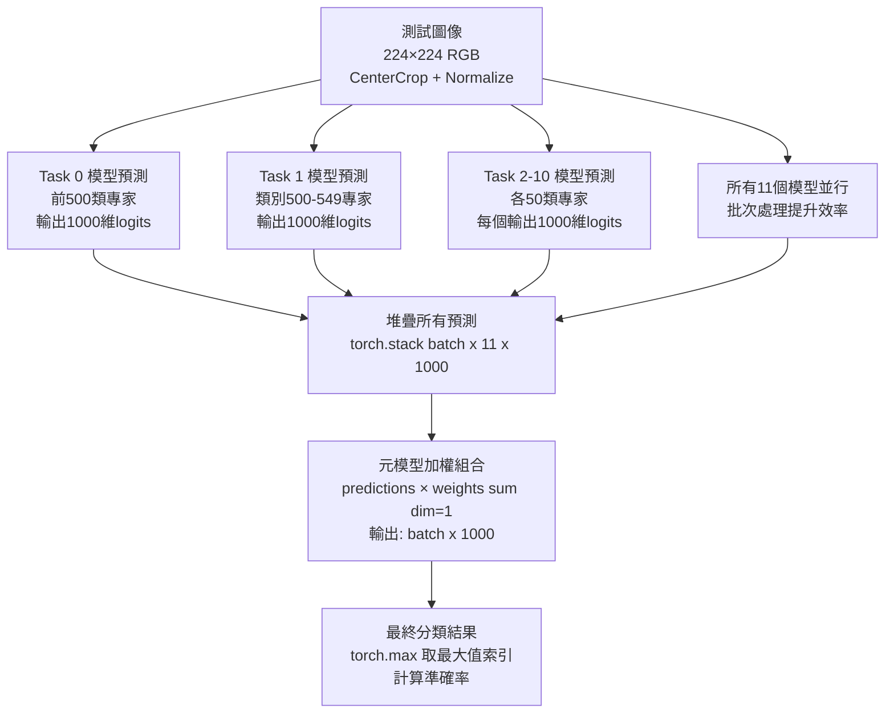

# Stacking Ensemble 方法流程圖

## 核心Stacking方法流程

## Stacking方法核心概念

## 元模型訓練過程

## 預測階段流程

## 核心優勢與量化指標

### 1. 智能權重分配策略

### 2. 兩階段學習流程

## 方法特點與技術細節

**多模型集成**:
- 11個基礎模型 (Task 0-10)
- 總計1000個類別覆蓋
- 並行推理提升效率

**自適應權重學習**: 
- 可訓練權重矩陣 [11×1000]
- 初始化策略考慮模型專精度
- 動態學習最佳組合比例

**知識保留機制**: 
- Task 0 模型保留基礎知識
- 元模型學習平衡舊新知識
- 有效緩解災難性遺忘

**性能提升策略**: 
- 批次大小32優化記憶體使用
- 學習率調度器防止過擬合
- 驗證集提早停止機制

## 輸出結果分析與評估指標

**整體準確率**: 
- 所有1000類的平均準確率
- 目標: 超越51.21% (單一最佳模型)

**前500類準確率**: 
- 基礎類別的知識保留效果
- 評估災難性遺忘程度

**後500類準確率**: 
- 新學習類別的掌握程度
- 評估增量學習效果

**類別級別分析**: 
- 每個類別的詳細表現
- 可視化柱狀圖 class_accuracies.png
- 詳細報告 results.txt

## 核心數值參數總結

| 參數項目 | 數值 | 說明 |
|---------|------|------|
| 基礎模型數量 | 11個 | Task 0-10 |
| 總類別數 | 1000 | 完整覆蓋 |
| Task 0 類別 | 500 | 基礎類別 |
| 其他Task類別 | 50/每個 | 增量類別 |
| 元模型訓練epochs | 30 | 適中避免過擬合 |
| 學習率 | 0.001 | Adam優化器 |
| 批次大小 | 32 | 記憶體優化 |
| Task 0 初始權重 | 1.5 | 基礎重要性 |
| 其他Task初始權重 | 3.0 | 強調專業性 |
| 數據分割比例 | 70:20:10 | 訓練:驗證:測試 |